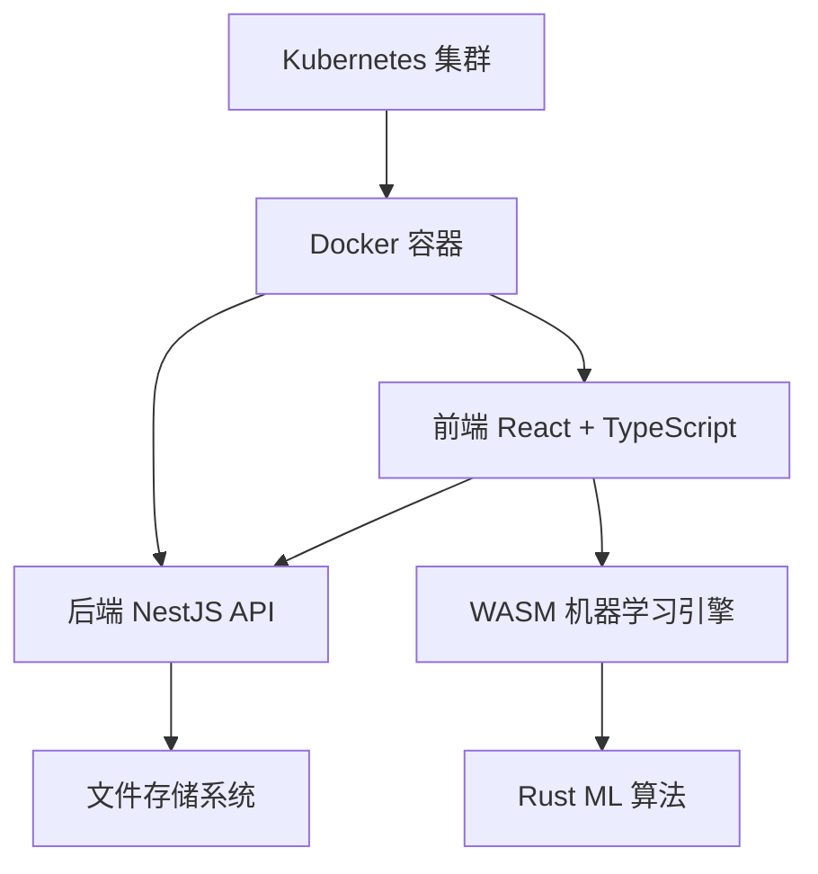

## 快速体验

```bash
# 克隆项目
git clone <repository-url>
cd smart-form-prediction

# 安装依赖
pnpm install

# 启动开发环境
pnpm dev
```

## 核心特性

### 🎯 智能预测算法

系统通过机器学习算法分析用户的表单填写习惯，能够：

- 识别用户输入模式
- 预测下一个字段的可能内容
- 根据上下文提供智能推荐
- 随着使用次数增加，预测准确性持续提升

### 🎨 灵活的表单配置

支持多种表单控件类型：

- **文本框** - 用于输入文本内容
- **数字框** - 专门处理数字输入
- **下拉框** - 提供预设选项
- **多选框** - 支持多项选择
- **密码框** - 安全的密码输入

### 🚀 优秀的用户体验

- **实时预测** - 无需等待，即时响应
- **多种交互方式** - 键盘、鼠标都支持
- **美观的界面** - 基于 Ant Design 的现代 UI
- **响应式设计** - 适配各种屏幕尺寸

## 技术架构



## 开源许可

本项目基于 [MIT 许可证](https://github.com/your-org/smart-form-prediction/blob/main/LICENSE) 开源。
